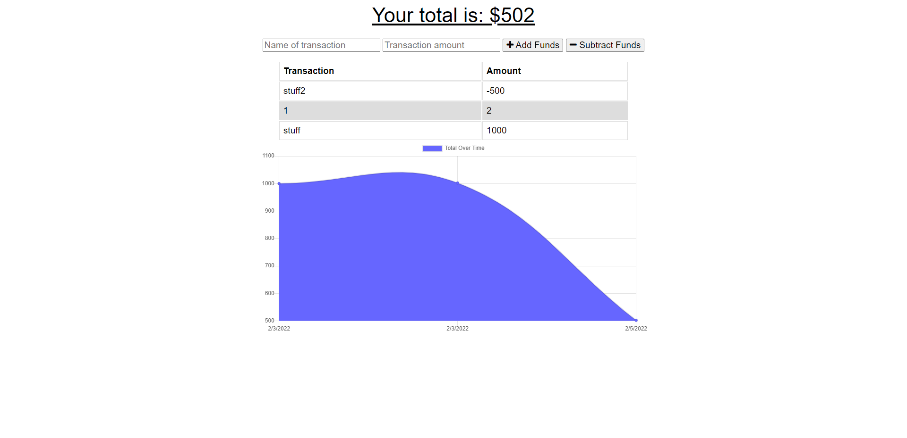

# on-off-budget-tracker

 <br> [MIT](https://opensource.org/licenses/MIT)

1.[ Description. ](#desc)
<br>
2.[ Installation. ](#inst)
<br>
3.[ Usage. ](#use)
<br>
4.[ Contributing. ](#contr)
<br>
5.[ Testing. ](#test)
<br>
6.[ Github. ](#git)
<br>
7.[ Contact Me.](#conta)
<br>

<a id="desc"></a>
## 1.Description

Budget tracker application that allows user to keep track of budgets. You can enter deposits and expenses. Added functionality allows user to access the information and deposit or enter expenses while there is no internet connection. When the user gains access to the internet again those offline additions will then persist.
Technologies used express, mongoDB, mongoose, compression, node.js, javascript, IndexedDB, service-worker

<a id="inst"></a>
Live linked website down below.

<a id="use"></a>
## 3.Usage

OPEN USE

<a id="contr"></a>
## 4.Contributing

OPEN CONTRIBUTION

<a id="test"></a>
## 5.Testing
```

```
<a id="git"></a>
## 6.Github

[GitHub](https://github.com/veidul)

[GitHub Repository](https://github.com/veidul/on-off-budget-tracker)

<a id="conta"></a>
## 7.Contact Me
Ludie Lambright
ludiefletcher@gmail.com

[Website Live Link](https://on-off-budget-tracker-veidul.herokuapp.com/)


